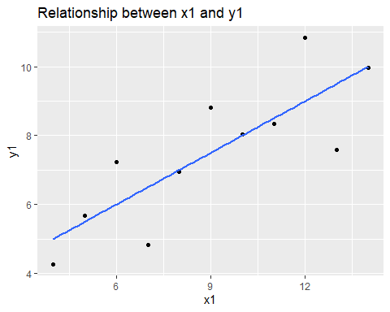
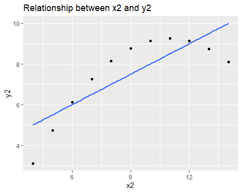
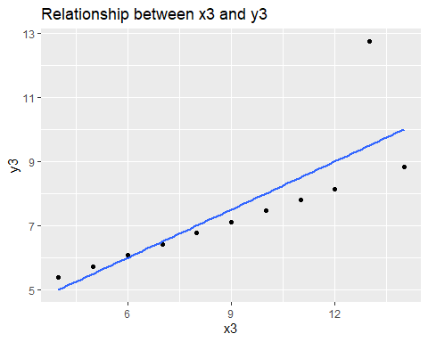
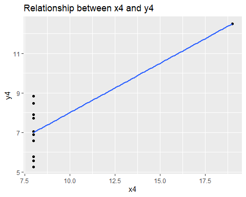

Anscombe’s Quartet: Visualising the Limits of Summary Statistics
================
Precious Nhamo
2026-04-21

# Overview

This document reproduces and extends the canonical demonstration from
Anscombe (1973), showing that four datasets with identical summary
statistics can have fundamentally different underlying structures. It is
a foundational exercise in applied econometrics: summary statistics
alone are insufficient for model evaluation – visualisation is
indispensable.

> “The simple graph has brought more information to the data analyst’s
> mind than any other device.” – John W. Tukey (1962)

**Source:** Dayal, V. (2020). *Quantitative Economics with R*. Springer
Nature Singapore. Chapter 4.

------------------------------------------------------------------------

# Setup

``` r
source("ansquartet.R")
```

    ## Rows: 11
    ## Columns: 8
    ## $ x1 <dbl> 10, 8, 13, 9, 11, 14, 6, 4, 12, 7, 5
    ## $ x2 <dbl> 10, 8, 13, 9, 11, 14, 6, 4, 12, 7, 5
    ## $ x3 <dbl> 10, 8, 13, 9, 11, 14, 6, 4, 12, 7, 5
    ## $ x4 <dbl> 8, 8, 8, 8, 8, 8, 8, 19, 8, 8, 8
    ## $ y1 <dbl> 8.04, 6.95, 7.58, 8.81, 8.33, 9.96, 7.24, 4.26, 10.84, 4.82, 5.68
    ## $ y2 <dbl> 9.14, 8.14, 8.74, 8.77, 9.26, 8.10, 6.13, 3.10, 9.13, 7.26, 4.74
    ## $ y3 <dbl> 7.46, 6.77, 12.74, 7.11, 7.81, 8.84, 6.08, 5.39, 8.15, 6.42, 5.73
    ## $ y4 <dbl> 6.58, 5.76, 7.71, 8.84, 8.47, 7.04, 5.25, 12.50, 5.56, 7.91, 6.89

------------------------------------------------------------------------

# Data

Anscombe’s Quartet (`datasets::anscombe`, built into R) consists of four
(x, y) pairs – 11 observations each – that share nearly
identical descriptive statistics (as seen in the summary statistics).

``` r
glimpse(anscombe_df)
```

    ## Rows: 11
    ## Columns: 8
    ## $ x1 <dbl> 10, 8, 13, 9, 11, 14, 6, 4, 12, 7, 5
    ## $ x2 <dbl> 10, 8, 13, 9, 11, 14, 6, 4, 12, 7, 5
    ## $ x3 <dbl> 10, 8, 13, 9, 11, 14, 6, 4, 12, 7, 5
    ## $ x4 <dbl> 8, 8, 8, 8, 8, 8, 8, 19, 8, 8, 8
    ## $ y1 <dbl> 8.04, 6.95, 7.58, 8.81, 8.33, 9.96, 7.24, 4.26, 10.84, 4.82, 5.68
    ## $ y2 <dbl> 9.14, 8.14, 8.74, 8.77, 9.26, 8.10, 6.13, 3.10, 9.13, 7.26, 4.74
    ## $ y3 <dbl> 7.46, 6.77, 12.74, 7.11, 7.81, 8.84, 6.08, 5.39, 8.15, 6.42, 5.73
    ## $ y4 <dbl> 6.58, 5.76, 7.71, 8.84, 8.47, 7.04, 5.25, 12.50, 5.56, 7.91, 6.89

------------------------------------------------------------------------

# Summary Statistics

All four datasets share the same means, standard deviations, and
regression coefficients. This is the central puzzle Anscombe (1973) set
out to illustrate.

``` r
anscombe_summary 
```

    ## # A tibble: 1 × 16
    ##   x1_mean x1_sd x2_mean x2_sd x3_mean x3_sd x4_mean x4_sd y1_mean y1_sd y2_mean
    ##     <dbl> <dbl>   <dbl> <dbl>   <dbl> <dbl>   <dbl> <dbl>   <dbl> <dbl>   <dbl>
    ## 1       9  3.32       9  3.32       9  3.32       9  3.32    7.50  2.03    7.50
    ## # ℹ 5 more variables: y2_sd <dbl>, y3_mean <dbl>, y3_sd <dbl>, y4_mean <dbl>,
    ## #   y4_sd <dbl>

# Regression Models

Four separate OLS models are fitted, one for each (x, y) pair.

``` r
modelresults
```

<table class="texreg" style="margin: 10px auto;border-collapse: collapse;border-spacing: 0px;color: #000000;border-top: 2px solid #000000;">

<caption>

Linear regressions for Anscombe subsets
</caption>

<thead>

<tr>

<th style="padding-left: 5px;padding-right: 5px;">

 
</th>

<th style="padding-left: 5px;padding-right: 5px;">

Model: y1 ~ x1
</th>

<th style="padding-left: 5px;padding-right: 5px;">

Model: y2 ~ x2
</th>

<th style="padding-left: 5px;padding-right: 5px;">

Model: y3 ~ x3
</th>

<th style="padding-left: 5px;padding-right: 5px;">

Model: y4 ~ x4
</th>

</tr>

</thead>

<tbody>

<tr style="border-top: 1px solid #000000;">

<td style="padding-left: 5px;padding-right: 5px;">

(Intercept)
</td>

<td style="padding-left: 5px;padding-right: 5px;">

3.00<sup>\*</sup>
</td>

<td style="padding-left: 5px;padding-right: 5px;">

3.00<sup>\*</sup>
</td>

<td style="padding-left: 5px;padding-right: 5px;">

3.00<sup>\*</sup>
</td>

<td style="padding-left: 5px;padding-right: 5px;">

3.00<sup>\*</sup>
</td>

</tr>

<tr>

<td style="padding-left: 5px;padding-right: 5px;">

 
</td>

<td style="padding-left: 5px;padding-right: 5px;">

(1.12)
</td>

<td style="padding-left: 5px;padding-right: 5px;">

(1.13)
</td>

<td style="padding-left: 5px;padding-right: 5px;">

(1.12)
</td>

<td style="padding-left: 5px;padding-right: 5px;">

(1.12)
</td>

</tr>

<tr>

<td style="padding-left: 5px;padding-right: 5px;">

x1
</td>

<td style="padding-left: 5px;padding-right: 5px;">

0.50<sup>\*\*</sup>
</td>

<td style="padding-left: 5px;padding-right: 5px;">

 
</td>

<td style="padding-left: 5px;padding-right: 5px;">

 
</td>

<td style="padding-left: 5px;padding-right: 5px;">

 
</td>

</tr>

<tr>

<td style="padding-left: 5px;padding-right: 5px;">

 
</td>

<td style="padding-left: 5px;padding-right: 5px;">

(0.12)
</td>

<td style="padding-left: 5px;padding-right: 5px;">

 
</td>

<td style="padding-left: 5px;padding-right: 5px;">

 
</td>

<td style="padding-left: 5px;padding-right: 5px;">

 
</td>

</tr>

<tr>

<td style="padding-left: 5px;padding-right: 5px;">

x2
</td>

<td style="padding-left: 5px;padding-right: 5px;">

 
</td>

<td style="padding-left: 5px;padding-right: 5px;">

0.50<sup>\*\*</sup>
</td>

<td style="padding-left: 5px;padding-right: 5px;">

 
</td>

<td style="padding-left: 5px;padding-right: 5px;">

 
</td>

</tr>

<tr>

<td style="padding-left: 5px;padding-right: 5px;">

 
</td>

<td style="padding-left: 5px;padding-right: 5px;">

 
</td>

<td style="padding-left: 5px;padding-right: 5px;">

(0.12)
</td>

<td style="padding-left: 5px;padding-right: 5px;">

 
</td>

<td style="padding-left: 5px;padding-right: 5px;">

 
</td>

</tr>

<tr>

<td style="padding-left: 5px;padding-right: 5px;">

x3
</td>

<td style="padding-left: 5px;padding-right: 5px;">

 
</td>

<td style="padding-left: 5px;padding-right: 5px;">

 
</td>

<td style="padding-left: 5px;padding-right: 5px;">

0.50<sup>\*\*</sup>
</td>

<td style="padding-left: 5px;padding-right: 5px;">

 
</td>

</tr>

<tr>

<td style="padding-left: 5px;padding-right: 5px;">

 
</td>

<td style="padding-left: 5px;padding-right: 5px;">

 
</td>

<td style="padding-left: 5px;padding-right: 5px;">

 
</td>

<td style="padding-left: 5px;padding-right: 5px;">

(0.12)
</td>

<td style="padding-left: 5px;padding-right: 5px;">

 
</td>

</tr>

<tr>

<td style="padding-left: 5px;padding-right: 5px;">

x4
</td>

<td style="padding-left: 5px;padding-right: 5px;">

 
</td>

<td style="padding-left: 5px;padding-right: 5px;">

 
</td>

<td style="padding-left: 5px;padding-right: 5px;">

 
</td>

<td style="padding-left: 5px;padding-right: 5px;">

0.50<sup>\*\*</sup>
</td>

</tr>

<tr>

<td style="padding-left: 5px;padding-right: 5px;">

 
</td>

<td style="padding-left: 5px;padding-right: 5px;">

 
</td>

<td style="padding-left: 5px;padding-right: 5px;">

 
</td>

<td style="padding-left: 5px;padding-right: 5px;">

 
</td>

<td style="padding-left: 5px;padding-right: 5px;">

(0.12)
</td>

</tr>

<tr style="border-top: 1px solid #000000;">

<td style="padding-left: 5px;padding-right: 5px;">

R<sup>2</sup>
</td>

<td style="padding-left: 5px;padding-right: 5px;">

0.67
</td>

<td style="padding-left: 5px;padding-right: 5px;">

0.67
</td>

<td style="padding-left: 5px;padding-right: 5px;">

0.67
</td>

<td style="padding-left: 5px;padding-right: 5px;">

0.67
</td>

</tr>

<tr>

<td style="padding-left: 5px;padding-right: 5px;">

Adj. R<sup>2</sup>
</td>

<td style="padding-left: 5px;padding-right: 5px;">

0.63
</td>

<td style="padding-left: 5px;padding-right: 5px;">

0.63
</td>

<td style="padding-left: 5px;padding-right: 5px;">

0.63
</td>

<td style="padding-left: 5px;padding-right: 5px;">

0.63
</td>

</tr>

<tr style="border-bottom: 2px solid #000000;">

<td style="padding-left: 5px;padding-right: 5px;">

Num. obs.
</td>

<td style="padding-left: 5px;padding-right: 5px;">

11
</td>

<td style="padding-left: 5px;padding-right: 5px;">

11
</td>

<td style="padding-left: 5px;padding-right: 5px;">

11
</td>

<td style="padding-left: 5px;padding-right: 5px;">

11
</td>

</tr>

</tbody>

<tfoot>

<tr>

<td style="font-size: 0.8em;" colspan="5">

<sup>\*\*\*</sup>p \< 0.001; <sup>\*\*</sup>p \< 0.01; <sup>\*</sup>p \<
0.05
</td>

</tr>

</tfoot>

</table>

Despite four structurally different datasets, every model returns an
intercept of 3.00, a slope of 0.50, and an R-squared of 0.67. Regression
output alone is uninformative about the true data-generating process.

------------------------------------------------------------------------

# Visualisation

## Dataset 1 – Linear relationship

The true relationship is linear. OLS assumptions are satisfied:
residuals are approximately normally distributed with constant variance.
The fitted line is an appropriate model.

``` r
plot_x1_y1 
```



## Dataset 2 – Nonlinear (quadratic) relationship

The underlying relationship is quadratic, not linear. The OLS fit masks
systematic curvature – residuals follow a clear arc. R-squared = 0.67 is
misleading here; a polynomial model (y ~ x + x^2) would be far more
appropriate. This violates the linearity assumption.

``` r
plot_x2_y2 
```



## Dataset 3 – Outlier / high-influence point

The relationship is linear except for one high-influence outlier at (x =
13, y = 12.74). This single point pulls the OLS slope upward and
inflates R-squared. Without it, the fit would be near-perfect with a
different slope. Cook’s distance would flag this point immediately.

``` r
plot_x3_y3 
```



## Dataset 4 – Leverage point

Ten observations share x = 8 (no variation in the regressor), while one
point sits at x = 19. That single leverage point entirely determines the
regression slope. There is no meaningful linear relationship – the
coefficient is an artefact of one observation, not a structural feature
of the data.

``` r
plot_x4_y4 
```



------------------------------------------------------------------------

# Key Finding

OLS regression and univariate summary statistics are not sufficient
diagnostics for model adequacy. All four models produce identical
coefficients and R-squared values, yet only Dataset 1 satisfies the
classical OLS assumptions (linearity, homoscedasticity, no influential
observations). This result motivates residual analysis, leverage
diagnostics, and – above all – graphical inspection as standard practice
in quantitative research.

------------------------------------------------------------------------

# References

Anscombe, F. J. (1973). Graphs in statistical analysis. *The American
Statistician*, 27(1), 17–21.

Dayal, V. (2020). *Quantitative Economics with R*. Springer Nature
Singapore.

Leifeld, P. (2013). texreg: Conversion of statistical model output in R
to LaTeX and HTML tables. *Journal of Statistical Software*, 55(8),
1–24.

Tukey, J. W. (1962). The future of data analysis. *Annals of
Mathematical Statistics*, 33(1), 1–67.

Wickham, H., et al. (2017). *tidyverse: Easily install and load the
tidyverse*. R package version 1.2.1.
